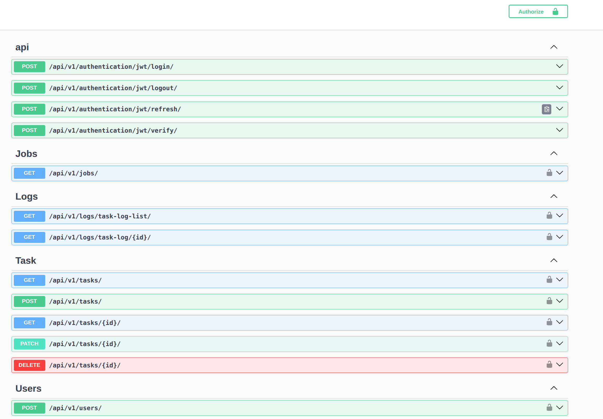

# hub_insight

This project is an online cron job that runs all tasks using a cron expression. There are default jobs that you can use by creating a scheduled task.

I use the [Django style guide](https://github.com/HackSoftware/Django-Styleguide) and tried to keep it.


I made this project with [this cookiecutter](https://github.com/amirbahador-hub/django_style_guide).

## APIS



I used [Django Simple JWT](https://github.com/jazzband/djangorestframework-simplejwt) for the authentication system, and I also use Celery beats to handle scheduled tasks.

as you see in picture:

 - you can create a new user
 - login and do any authentication
 - view default jobs
 - create task (schedule task) and manage them
 - see logs of task (runned successfuly or not)

super user can see all tasks and all logs but normal user just can see their own logs and tasks.

## Default Jobs

default jobs are in ```hub_insight/default_jobs```.

for first run you have to run this command to save default jobs in db:
```python
python manage.py init
```

this command can update jobs and you need to run this command to see default jobs in result of jobs api.

### Add/Remove/Edit Default Jobs

you can add your job if you want.

this is easy. you just create a script like this in `default_jobs` folder:

```python
from hub_insight.utils.typing import JobDetail


def job_detail() -> JobDetail:
    detail:JobDetail = {
        "help": "Hello World Job",
        "name": "Hello World",
        "version":"v1"
    }

    return detail


def run_job() -> str:
    """
    print hello world

    Returns:
        str: return 'hello world'
    """
    return  True, 'hello world'


```

the `job_detail` function defines data about your job. As you see, data like: name of job, help, and version of job.

the `run_job` for main logic of your job. this is very important. if your job need some input args, you must define it and set type it. and for response value, you must define it. for example, here I say my output is a `str`.

but I return a tuple, a boolean type and str. return type to just define normal and standard response type for job but we must return a tuple to tell this job runned successfuly or not.

here is another example:

```python
def run_job(url:str) -> int:
    """
    check status code of a website

    Args:
        url (str): url of a site

    Returns:
        int: status code
    """

    try:
        response = requests.get(url=url)

        return True, response.status_code

    except requests.ConnectionError:

        return False, "Connection Error To Website!"
    
    except requests.RequestException:

        return False, "Request Exception!"
    
    except requests.Timeout:
        return False, "Timeout!"
    
    except requests.ConnectTimeout:

        return False, "Connection Timeout!"

    except Exception:

        return False , "Something Wrong!"

```

if you want to edit something about your job like input args or any, you need to change `version` value in the 
`job_detail` function. 

if you want to remove it, just remove your script. the `init` command will be handle it.

after add, edit or remove a job, you must run `init` command to save it in DB:
```bash
python manage.py init
```

for example this is output of jobs list api:
```JSON
{
  "count": 3,
  "next": null,
  "previous": null,
  "page_size": 5,
  "results": [
    {
      "id": 33,
      "name": "Hello World",
      "help": "Hello World Job",
      "variables": [],
      "response_type": "str"
    },
    {
      "id": 34,
      "name": "Add Two Numbers",
      "help": "This job is for add two numbers. number_one + number_two",
      "variables": [
        {
          "name": "number_one",
          "var_type": "int",
          "default": "1"
        },
        {
          "name": "number_two",
          "var_type": "int",
          "default": "2"
        }
      ],
      "response_type": "int"
    },
    {
      "id": 35,
      "name": "Check WebSite Status code",
      "help": "check status code of url with get method",
      "variables": [
        {
          "name": "url",
          "var_type": "str",
          "default": null
        }
      ],
      "response_type": "int"
    }
  ]
}
```

wee need input args to define the task. And this is important to define their type because we have a validation checker for input values in the create task API.

## project setup

1- compelete cookiecutter workflow (recommendation: leave project_slug empty) and go inside the project
```bash
cd hub_insight
```

2- SetUp venv
```bash
virtualenv  venv
source venv/bin/activate
```

3- install Dependencies
```bash
pip install -r requirements_dev.txt
pip install -r requirements.txt
```

4- create your env
```bash
cp .env.example .env
```

5- Create tables
```bash
python manage.py migrate
```

6- spin off docker compose
```bash
docker compose -f docker-compose.dev.yml up -d
```

7- run the project
```bash
python manage.py runserver
```

or run just with docker compose:

```bash
docker compose up
```
